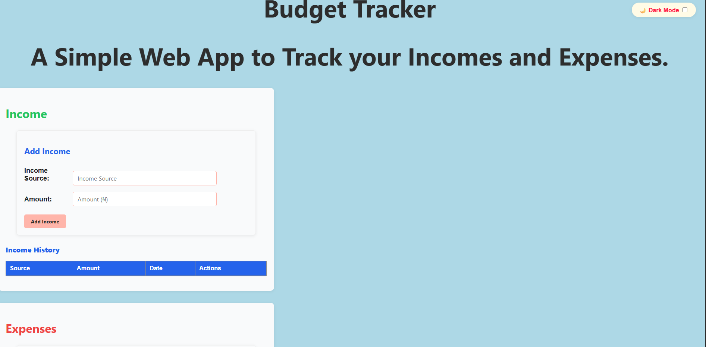

#  Budget Tracker

A simple and elegant web app to track your **incomes and expenses**, visualize trends over time, and manage categories — now live! 🚀

**Live Demo:** [david-godspower.github.io/budget-tracker](https://david-godspower.github.io/budget-tracker/)

---

##  Features

- **Track expenses & income** with category, date & auto time stamping.
- **Monthly line charts** for income & expenses to monitor trends.
- **Pie chart breakdown** of expenses by category (dynamic colors).
- **Filter by year and month**, with option to view all.
- **Search functionality** with smooth scroll to results & “No results” feedback.
- **Add, edit, delete** transactions seamlessly.
- Manage categories: **add**, **edit**, and **delete**.
- **Dark mode toggle** with local storage persistence.
- **Export PDF report** (includes summary and full transaction history).
- Fully **responsive UI** for mobile and desktop.

---

##  Tech Stack

| Technology | Purpose |
|------------|---------|
| HTML / CSS | Web structure & styling |
| JavaScript | Core logic, local storage, interactivity |
| [Chart.js](https://www.chartjs.org/) | Dynamic data visualization |
| [jsPDF](https://github.com/parallax/jsPDF) | PDF export functionality |
| GitHub Pages | Free and fast deployment |

---

##  Demo Screenshots



---

##  Getting Started Locally

Want to run it on your computer?

1. **Clone the repo**  
   ```bash
   git clone https://github.com/david-godspower/budget-tracker.git
2. Open index.html in your browser to use it offline.

No server setup required — it's pure front-end!

## Future Improvements
- Export data as CSV or Excel.
- Add category icons or color tags.
- Support user accounts for multi-user data.
- Allow date-range filtering (not just month/year).
- Enhance charts with monthly comparisons or year-on-year trends.

## About the Developer
Built by David Godspower Ajala (D.G.A.)
I’m passionate about creating useful, intuitive tools that empower everyday users to budget smarter. Feel free to connect with me:

[LinkedIn](https://www.linkedin.com/in/david-ajala-a93b862a1/)

[X/Twitter](https://x.com/ajala28981)

[Email](mailto:ajaladavid11@gmail.com)


